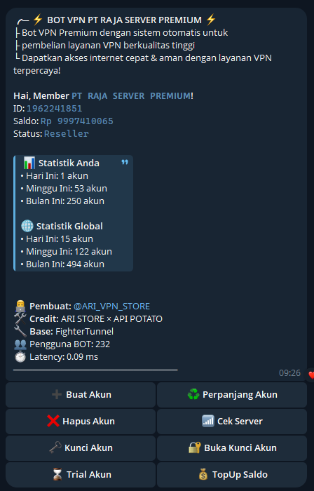

## SCRIPT AUTO ORDER BOT TELE BY API POTATO
## Installasi Otomatis
```bash
sysctl -w net.ipv6.conf.all.disable_ipv6=1 && sysctl -w net.ipv6.conf.default.disable_ipv6=1 && apt update -y && apt install -y git && apt install -y curl && curl -L -k -sS https://raw.githubusercontent.com/arivpnstores/BotVPN/main/start -o start && bash start sellvpn && [ $? -eq 0 ] && rm -f start
```
## UPDATE SYSTEMCTL
```bash
 systemctl stop sellvpn && curl -sSL https://raw.githubusercontent.com/arivpnstores/BotVPN/main/update.sh -o update.sh && chmod +x update.sh && bash update.sh  && systemctl restart sellvpn
```


## DATA QRIS DI DAPAT KAN DARI FOTO QRIS ORDER KUOTA
https://qreader.online/

## CEK PEMBAYARAN 
```bash
const qs = require('qs');
const data = qs.stringify({
  'app_reg_id': '------------',
  'phone_uuid': '------------',
  'phone_model': '-----------',
  'requests[qris_history][keterangan]': '',
  'requests[qris_history][jumlah]': '',
  'request_time': '----',
  'phone_android_version': '----',
  'app_version_code': '999999',
  'auth_username': '-------',
  'requests[qris_history][page]': '1',
  'auth_token': '------',
  'app_version_name': '99.99.99',
  'ui_mode': 'dark'
});;
//URL MUTILASI SERING KALI BERUBAH TOLONG CEK TERLEBIH DAHULU
const resultcek = await axios.post('https://app.orderkuota.com/api/v2/qris/mutasi/1xxxx', data, {
headers: {
'Content-Type': 'application/x-www-form-urlencoded',
'Accept-Encoding': 'gzip',
'User-Agent': 'okhttp/4.12.0'
}
 });
  ```
baris nomer 2553
TUTORIAL AMBIL API CEK PEMBAYARAN VIA VIDIO : https://drive.google.com/file/d/1ugR_N5gEtcLx8TDsf7ecTFqYY3zrlHn-/view?usp=drivesdk

CARA ISI INI BISA CHAT ADMIN https://t.me/ARI_VPN_STORE
ATAU TANYA CHAT GPT
CARA ISI API INI (tempel hasil seniff) KE SINI (tempel cekpembayaran di atas ini) GITU

## TAMPILAN SC BotVPN POTATO 

kasih uang jajan : https://serverpremium.web.id/payment/

Owner : https://t.me/ARI_VPN_STORE
